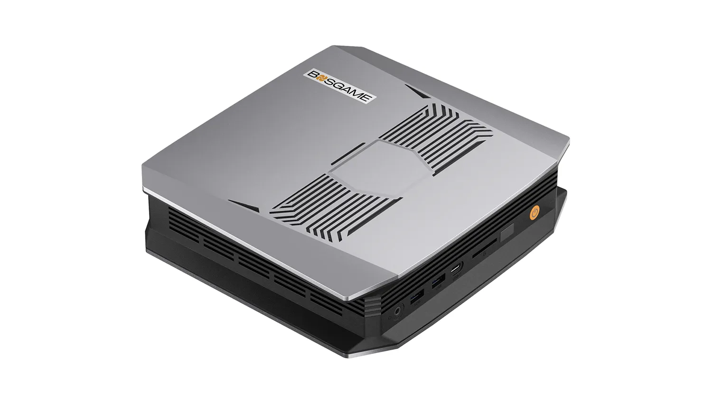

# hal-10k-platform


Infrastructure-as-code and runbooks for the **HAL-10k Self-Hosted AI Server** running on
a BOSGAME M5 AI Mini (AMD Ryzen AI Max+ 395, 128 GB unified RAM/VRAM).

> **HAL-10k! Self-Hosted AI Server**
> 
> HAL-10k - HAL-9000 went Super Saiyan 4. Power level: 10,000!

> **What people say about HAL-10k!**
> 
> *"That low-class clown... he is a genius!" — Vegeta*
> 
> *"AI Singularity, in the palm of your hand!" — Doc Oc*
> 
> *"A shadowy flight into the dangerous world of a man who does not exist!"* — K.I.T.T.

## Purpose

This repository is the versioned source of truth for everything deployed on HAL-10k:

- **Runbooks** — step-by-step procedures for the manual bootstrap phases
- **Compose stacks** — Docker Compose definitions for all services
- **Scripts** — helper automation for day-to-day operations
- **Secrets** — SOPS-encrypted credentials (plaintext never committed)
- **Decisions** — Architecture Decision Records (ADRs)

## Hardware



| Component | Spec |
|-----------|------|
| Platform | BOSGAME M5 AI Mini |
| CPU | AMD Ryzen AI Max+ 395 (16C/32T, Zen 5) |
| RAM/VRAM | 128 GB LPDDR5X unified |
| iGPU | AMD RDNA 3.5, 40 Compute Units |
| Storage | 2 TB NVMe SSD |
| OS | Pop!_OS 24.x LTS |

See [docs/hardware/bosgame-m5-ai-specs.md](docs/hardware/bosgame-m5-ai-specs.md) for full hardware specifications.

## Disk Layout

| Partition | Mount | Size | Purpose |
|-----------|-------|------|---------|
| EFI | /boot/efi | 512 MB | UEFI boot |
| Boot | /boot | 2 GB | Kernel / initrd |
| Root | / | 350 GB | OS + system packages |
| Platform | /srv/platform | 1.35 TB | All service data |
| Timeshift | (dedicated) | 250 GB | System snapshots |

## Platform Directory Layout (`/srv/platform`)

```
/srv/platform/
├── compose/         # Live Compose stacks (symlinked from repo)
├── docker/          # Docker data-root (images, volumes, metadata)
├── models/          # LLM model weights (Ollama, etc.)
├── datasets/        # Training and evaluation datasets
├── vectordb/        # ChromaDB persistent storage
├── backups/         # Application-level backups
└── secrets/         # Runtime secrets (populated by SOPS decrypt)
```

## Two-Layer Architecture

HAL-10k runs two distinct, isolated layers. The **Platform Layer** hosts stable production
services under Docker Compose. The **Experimentation Layer** hosts disposable, GPU-accelerated
ML environments under Distrobox (rootless Podman). Experiments that prove stable and valuable
graduate to the Platform Layer after meeting the four graduation criteria (daily use, config
stabilized, reboot persistence, documented in runbook).

```
/srv/platform/                    ← Platform Layer (Docker Compose)
├── compose/                      # Live Compose stacks
├── docker/                       # Docker data-root
├── models/                       # LLM model weights (Ollama, LM Studio)
├── datasets/                     # Training and evaluation datasets
├── vectordb/                     # ChromaDB persistent storage
├── backups/                      # Application-level backups
└── secrets/                      # Runtime secrets (SOPS-decrypted)

/srv/experiments/                 ← Experimentation Layer (Distrobox)
├── create.sh                     # Version-controlled container creation commands
├── ml-lab/                       # Python 3.12, PyTorch stable, Transformers
├── llama-build/                  # C++, CMake, ROCm, Vulkan SDK
├── agents-dev/                   # LangChain, CrewAI, AutoGen
├── ragna-ml/                     # JupyterLab + ML baseline stack
└── torch-nightly/                # PyTorch nightly (isolated)
```

See [docs/architecture/experimentation-layer.md](docs/architecture/experimentation-layer.md)
for the full architecture, design principles, lifecycle diagram, and graduation criteria.

---

## Service Inventory

| Service | URL | Status |
|---------|-----|--------|
| Portainer | https://hal-10k:9443 | ✅ Running |
| Dockge | http://hal-10k:5001 | ✅ Running |
| Traefik | http://hal-10k:8080 | ✅ Running  |
| Ollama | http://hal-10k:11434 | 🔜 Planned |
| Open WebUI | http://hal-10k:3000 | 🔜 Planned |
| LiteLLM | http://hal-10k:4000 | 🔜 Planned |
| ChromaDB | http://hal-10k:8000 | 🔜 Planned |
| n8n | http://hal-10k:5678 | 🔜 Planned |
| Gitea | http://hal-10k:3001 | 🔜 Planned |

## Quick Start

```bash
# 1. Clone this repo on HAL-10k
git clone https://github.com/ragnarokkrr/hal-10k-platform.git /srv/platform/repos/hal-10k-platform
cd /srv/platform/repos/hal-10k-platform

# 2. Decrypt secrets
./scripts/secrets-decrypt.sh

# 3. Deploy a stack
cd compose/core && docker compose up -d
```

See [WORKFLOW.md](WORKFLOW.md) for the full development and deployment workflow.
See [ROADMAP.md](ROADMAP.md) for planned phases.

## Reference Notes (HAL-10k Personal Assistant - Obsidian Vault)

All `homelab`-tagged vault notes used to build this project:

- `homelab/hal-10k` · `homelab/bosgame-m5-ai`

| Note | Topic |
|------|-------|
| HAL-10k - Self Hosted AI Server | Project overview |
| hal-10k-software-inventory-installed-stack | Installed software inventory |
| create-srv-platform-partition-gparted-live | /srv/platform partitioning procedure |
| service-platform-partition-strategy | Platform partition directory strategy |
| install-rocm-on-popos | ROCm 7.2 installation |
| timeshift-configurations | Timeshift backup config |
| docker-portainer-dockge-how-to | Docker + Portainer + Dockge setup |
| bosgame-m5-initial-software-popos-xrdp-xfce-remmina | OS baseline setup |
| self-host-llm-on-bosgame-m5-ai-mini | LLM hosting guide and BIOS tuning |
| multi-model-specialization-bosgame-m5 | Multi-model concurrency strategy |
| hal-10k-pa-embedded-mode | PA embedded mode strategy |
